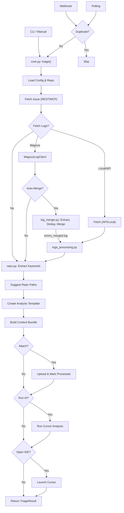

# Jira-Triage Architecture

**Token-Optimized Flow Document**

## Data Flow

## Key Components

| Component | File(s) | Description |
|-----------|---------|-------------|
| **Entry** | `cli.py`, `webhook.py`, `polling_service.py` | Routes to orchestrator. Polling uses JQL `assignee=currentUser()`. |
| **Core** | `core.py` | Orchestrates fetch, process, analysis, and output generation. |
| **Jira** | `jira_client.py`, `jira_mcp.py`, `jira_attachments.py` | REST API (w/ token fallback), MCP fallback, attachment upload. |
| **Dedup** | `duplicate_detection.py`, `processed_tickets.py` | SQLite cache & attachment-based duplicate prevention. |
| **Logs** | `magnus_log_client.py`, `logs_client.py`, `logs_local.py` | Fetches device logs. Magnus extracts MAC/Dates from description. |
| **Merge** | `log_merger.py` | Extracts nested archives, categorizes, deduplicates (MD5), merges. |
| **Process**| `logs_processing.py` | Cleans logs, extracts signals (CPU, Memory, Errors, Stacks). |
| **Repo** | `repo.py`, `date_extractor.py` | Keyword/date extraction, suggests relevant source code paths. |
| **Context**| `context_builder.py`, `cursor_analysis.py` | Creates context bundle, runs optional AI agent analysis. |

## Output Structure (`out/<TICKET-KEY>/`)
- `issue.json`, `jira_source.json`, `jira_preflight.json`, `repo_paths.json`
- `logs.summary.json/md`, `logs.cleaned.txt`
- `logs/magnus/` (raw), `logs/merged/` (categorized & merged by `log_merger.py`)
- `analysis.md` (user workspace), `context.md`, `bundle.zip`
- `.cursor/context/TICKET.md` (IDE context)

## Configuration Priorities
1. **CLI Args**: `--repo`, `--no-magnus-merge`, `--process-logs`
2. **`.env` vars**: `JIRA_BASE_URL`, `MAGNUS_AUTO_MERGE_LOGS`, `JIRA_POLLING_INTERVAL`
3. **MCP Config**: `~/.cursor/mcp.json`

## Error Handling
- `ConfigError`: Setup issues (fatal)
- `TriageError`: Processing failures (fatal)
- `JiraError`: API/Auth issues (fatal if no fallback)
- Non-fatal: Log fetching/merging, AI analysis, or attachment uploads.